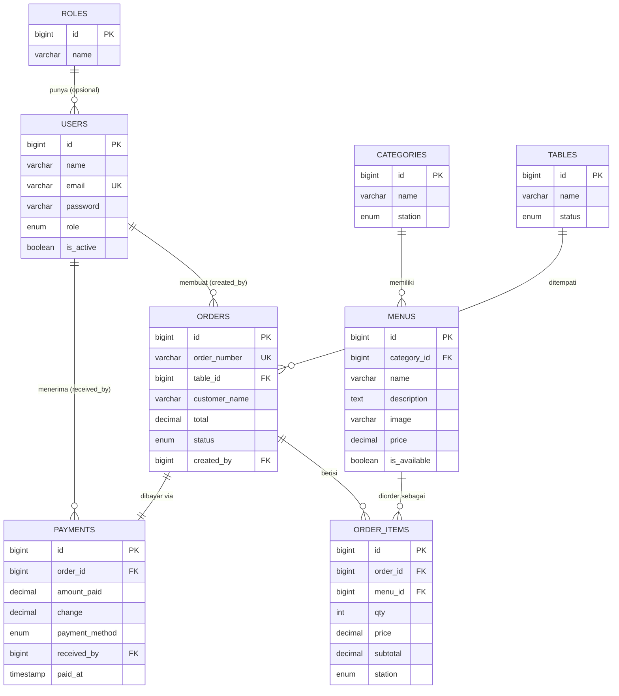

# ERD — Entity Relationship Diagram

**Proyek:** Pitou Cafe — POS Coffee Shop
**Versi:** 1.0
**Terkait:** `02-SRS.md` (FR & BR), `04-Database.md` (detail field)

---

## 1. Daftar Entitas

**Master**

| Tabel | Fungsi |
|---|---|
| `users` | Akun & role pengguna |
| `roles` | *(opsional)* Referensi role bila tidak pakai enum di `users` |
| `categories` | Kategori menu (menentukan station tujuan) |
| `menus` | Daftar menu + harga + ketersediaan |
| `tables` | Meja + status kosong/terisi |

**Transaksi**

| Tabel | Fungsi |
|---|---|
| `orders` | Order aktif per meja |
| `order_items` | Baris item di dalam order |
| `payments` | Pembayaran per order |

---

## 2. Diagram Relasi (Mermaid)

---

## 3. Penjelasan Relasi (Cardinality)

| Relasi | Tipe | Keterangan |
|---|---|---|
| `roles → users` | 1 : N | *(opsional)* Satu role dipakai banyak user. Kalau pakai enum di `users.role`, tabel `roles` tidak diperlukan. |
| `users → orders` | 1 : N | Satu user (Waiters) membuat banyak order (`orders.created_by`). |
| `users → payments` | 1 : N | Satu user (Kasir) menerima banyak pembayaran (`payments.received_by`). |
| `categories → menus` | 1 : N | Satu kategori punya banyak menu. |
| `menus → order_items` | 1 : N | Satu menu bisa muncul di banyak baris order. |
| `orders → order_items` | 1 : N | Satu order berisi banyak item. |
| `tables → orders` | 1 : N | Satu meja bisa punya banyak order **sepanjang riwayat**, tapi hanya **1 order aktif** pada satu waktu (BR-001 / BR-012). |
| `orders → payments` | 1 : 1 | Satu order dibayar tepat satu kali (BR-011). |

---

## 4. Catatan Desain

* **`roles` opsional.** Pitou Cafe memakai `enum` di `users.role`, jadi tabel `roles` tidak wajib. Diagram tetap menampilkannya sebagai alternatif bila nanti ingin role dinamis.
* **`categories.station`.** Kolom `station` ditaruh di `categories` sebagai *sumber kebenaran* untuk auto-routing BR-003 (makanan → kitchen, minuman → barista). Saat order dibuat, nilainya **disalin** ke `order_items.station` agar tetap benar walau kategori menu berubah di kemudian hari.
* **`orders.status`** memakai `enum('active','paid')` (bukan `aktif/selesai`) supaya sinkron antar dokumen. Transaksi dianggap selesai saat `payments.paid_at` terisi (BR-005).
* **Tidak ada kolom status masak** di `order_items` — sesuai FR-006/FR-007 & BR-009 (station hanya lihat antrian + cetak checker, tidak ada `cooking`/`ready`).
* Detail tipe data, panjang kolom, index, dan perilaku `onDelete` dijelaskan di `04-Database.md`.

Implementasikan Modul 3 sesuai PRD, SRS, ERD, Database Design, dan frame Figma yang saya lampirkan.

Ikuti desain sedekat mungkin.
Jangan mengubah struktur database.
